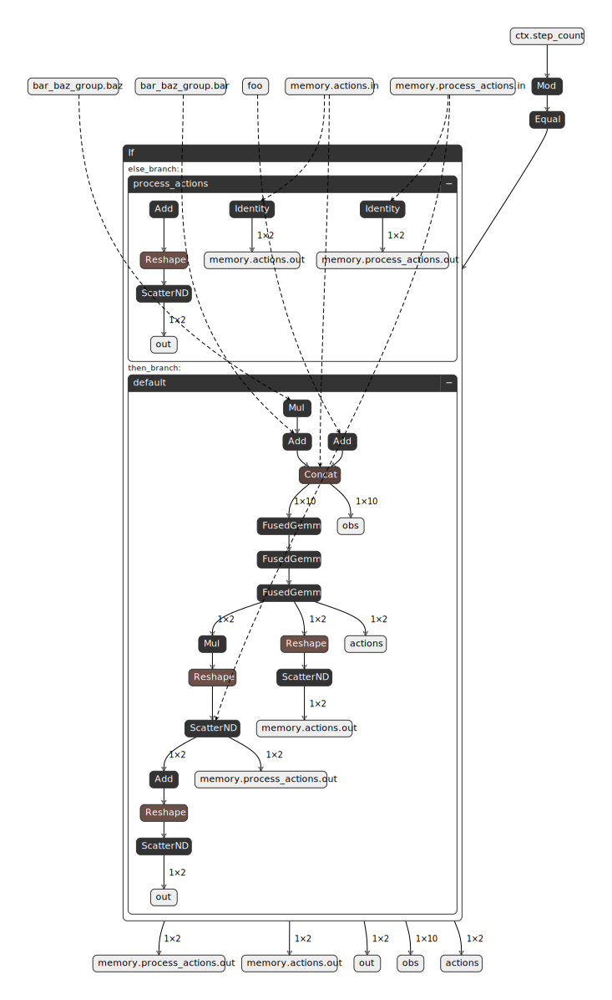
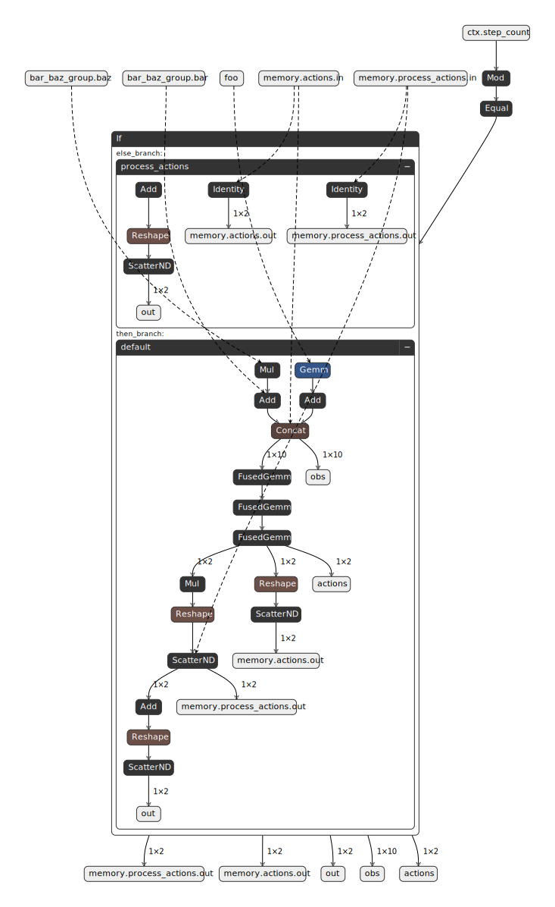
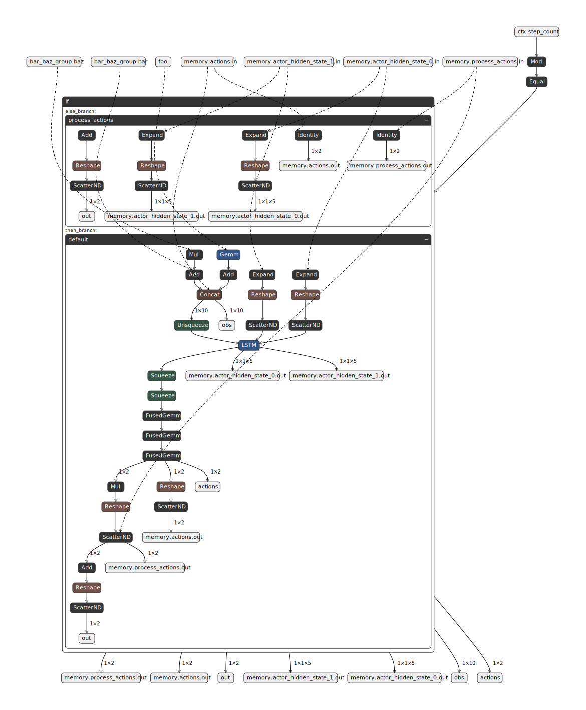

<!-- Copyright (c) 2026 Robotics and AI Institute LLC dba RAI Institute. All rights reserved. -->

# Exporter Tutorial

This tutorial walks through exporting a Reinforcement Learning environment and its policy to a
self-contained ONNX file using `exploy.exporter.core`. Rather than exporting only the neural
network, exploy captures the entire environment logic — observation computation, action processing,
and any additional inputs and outputs — into a single ONNX graph. This ensures the exported model
behaves identically in simulation and on hardware.

By the end of this tutorial you will know how to:

1. Create an exportable adapter for an existing environment.
2. Register inputs, outputs, and memory with the context manager.
3. Create an actor (policy network).
4. Export the environment to ONNX.
5. Load and run the exported model.
6. Validate the export by comparing ONNX outputs against the original environment.

> **Note:** A complete, runnable version of the code in this tutorial is available as a test in
> [`python/exploy/exporter/core/tests/test_export_environment.py`](https://github.com/rai-opensource/exploy/blob/main/python/exploy/exporter/core/tests/test_export_environment.py).
> This tutorial explains the details behind that test step by step.

## Prerequisites

The tutorial uses the following imports:

```python
import pathlib
import tempfile

import torch

from exploy.exporter.core.actor import ExportableActor, add_actor_memory
from exploy.exporter.core.context_manager import Group, Input, Memory, Output
from exploy.exporter.core.evaluator import evaluate, evaluate_episode
from exploy.exporter.core.exportable_environment import ExportableEnvironment
from exploy.exporter.core.exporter import export_environment_as_onnx
from exploy.exporter.core.session_wrapper import SessionWrapper
```

---

## Step 1 — Define the Data Source and the Environment

Before we can export anything, we need an environment to export. In a real project this would
typically be a simulation environment (e.g., from IsaacLab or another RL framework). For this
tutorial we define a minimal data source and environment from scratch.

### Data source

An environment typically reads state from some external source (sensors, a simulator, etc.). Here
we create a simple `DataSource` that holds a few tensors and can step and reset them:

```python
class DataSource:
    """Provides state tensors to the environment."""

    def __init__(self):
        self._init_foo = torch.Tensor([[1.0, 2.0, 3.0, 4.0]])
        self._init_bar = torch.Tensor([[0.5, 0.6]])
        self._init_baz = torch.Tensor([[-7.0, -8.0]])

        self.foo = self._init_foo.clone()
        self.bar = self._init_bar.clone()
        self.baz = self._init_baz.clone()

    def reset(self):
        """Reset to initial state."""
        self.foo[:] = self._init_foo
        self.bar[:] = self._init_bar
        self.baz[:] = self._init_baz

    def step(self):
        """Advance state to emulate a changing environment."""
        self.foo[:] += 0.1
        self.bar[:] += 0.2
        self.baz[:] += 0.3
```

The data source stores its initial values so it can be reset, and its `step()` method mutates the
tensors in place — just like a physics simulator would update joint positions and velocities each
tick.

### Environment

The `Environment` class represents a standard RL environment. It owns a `DataSource`, computes
observations from the state tensors, processes and applies actions, and implements a `step()`
method that advances the simulation:

```python
class Environment:
    """A simple Reinforcement Learning environment."""

    def __init__(self, data_source: DataSource):
        self._data_source = data_source
        self._decimation = 4
        self._actions = torch.zeros(1, 2)
        self._processed_action = torch.zeros_like(self._actions)
        self._output = torch.zeros_like(self._actions)

        self._reset_after_steps = 10
        self._step_count = 0

    @property
    def num_act(self) -> int:
        return self._actions.shape[-1]

    @property
    def num_obs(self) -> int:
        return self.compute_obs().shape[-1]

    @property
    def data_source(self):
        return self._data_source

    def compute_obs(self) -> torch.Tensor:
        return torch.cat(
            [
                self.data_source.foo + 1.0,
                self.data_source.bar + 2.0 * self.data_source.baz,
                self.data_source.baz,
                self._actions,
            ],
            dim=-1,
        )

    def process_actions(self, actions: torch.Tensor):
        self._actions[:] = actions
        self._processed_action[:] = 3 * actions

    def apply_actions(self):
        self._output[:] = self._processed_action + 2

    def step(self, actions: torch.Tensor) -> tuple[torch.Tensor, bool]:
        done = False

        self.process_actions(actions)

        for _ in range(self._decimation):
            self.apply_actions()
            self.data_source.step()

        self._step_count += 1

        if self._step_count >= self._reset_after_steps:
            self._step_count = 0
            self._data_source.reset()
            self._actions[:] = torch.zeros_like(self._actions)
            done = True

        obs = self.compute_obs()
        return obs, done
```

Note that `compute_obs()` uses only torch operations — it concatenates tensors from the data
source together with the current actions. This is important because these operations will be
traced during ONNX export.

At this point, `DataSource` and `Environment` are plain Python classes with no dependency on
exploy. The next step is to create an adapter that makes the environment exportable.

---

## Step 2 — Implement the Exportable Environment Adapter

The exporter needs a standardized interface to trace observation computation, action processing,
and simulation stepping. This interface is defined by the
{py:class}`ExportableEnvironment <exploy.exporter.core.exportable_environment.ExportableEnvironment>` abstract base class.

Rather than modifying the original `Environment` class, create a thin adapter — `ExportableEnv` —
that wraps it and delegates each method:

```python
class ExportableEnv(ExportableEnvironment):
    """Adapter that makes an Environment exportable to ONNX."""

    def __init__(self, env: Environment):
        super().__init__()
        self._env = env

    @property
    def env(self) -> Environment:
        return self._env

    # -- Required abstract methods -------------------------------------------------

    def compute_observations(self) -> torch.Tensor:
        return self.env.compute_obs()

    def process_actions(self, actions: torch.Tensor):
        return self.env.process_actions(actions)

    def apply_actions(self):
        return self.env.apply_actions()

    def step(self, actions: torch.Tensor) -> tuple[torch.Tensor, bool]:
        return self.env.step(actions)

    @property
    def decimation(self) -> int:
        return self.env._decimation

    def prepare_export(self):
        pass

    def empty_actor_observations(self) -> torch.Tensor:
        return torch.zeros_like(self.env.compute_obs())

    def empty_actions(self) -> torch.Tensor:
        return torch.zeros_like(self.env._actions)

    def metadata(self) -> dict:
        return {"env_name": "Env", "version": "1.0"}

    def register_evaluation_hooks(self, update, evaluate_substep):
        pass

    def get_observation_names(self) -> list[str]:
        obs1_names = [f"foo_{i}" for i in range(self.env.data_source.foo.shape[-1])]
        obs2_names = [f"bar_{i}" for i in range(self.env.data_source.bar.shape[-1])]
        obs3_names = [f"baz_{i}" for i in range(self.env.data_source.baz.shape[-1])]
        obs4_names = [f"actions_{i}" for i in range(self.env._actions.shape[-1])]
        return obs1_names + obs2_names + obs3_names + obs4_names

    def observations_reset(self) -> torch.Tensor:
        return self.env.compute_obs()
```

A few things to note about the methods:

- **`compute_observations()`** — Must use only traceable torch operations so the computation graph
  can be captured during ONNX export. The adapter delegates to `env.compute_obs()`, which
  already satisfies this requirement.
- **`process_actions()` / `apply_actions()`** — Split the action pipeline so the exporter can
  trace the path from raw actions to commanded outputs at the simulation time-step rate.
- **`decimation`** — The number of simulation sub-steps per policy step (e.g., policy runs at
  50 Hz while simulation runs at 200 Hz → decimation = 4).
- **`step()`** — Called during evaluation to advance the environment. Returns updated observations
  and a flag indicating whether a reset occurred.
- **`metadata()`** — Arbitrary key-value pairs that are embedded in the exported ONNX file.

---

## Step 3 — Register Inputs, Outputs, and Memory

The exporter traces the torch operations inside `compute_observations()` to build the ONNX graph,
but it also needs to know which tensors correspond to named inputs and outputs of the graph. This
is where the context manager comes in.

Looking at `compute_obs()` from Step 1, the observation is computed from three state tensors
(`foo`, `bar`, `baz`) and the previous actions:

```python
torch.cat([
    self.data_source.foo + 1.0,
    self.data_source.bar + 2.0 * self.data_source.baz,
    self.data_source.baz,
    self._actions,
], dim=-1)
```

Each of these tensors needs to be declared so the exporter knows how to feed data into the ONNX
graph at inference time. Additionally, the environment produces an output (`self._output`) that we
want to read back after each inference call. We register all of these on the
{py:class}`ContextManager <exploy.exporter.core.context_manager.ContextManager>` using three component types:

| Component | Direction | Purpose |
|-----------|-----------|---------|
| {py:class}`Input <exploy.exporter.core.components.Input>`   | Into the graph | Raw state data read from the robot/simulator |
| {py:class}`Output <exploy.exporter.core.components.Output>`  | Out of the graph | Computed values to send to the robot/simulator |
| {py:class}`Memory <exploy.exporter.core.components.Memory>`  | Both | Values that persist across inference calls |

`foo`, `bar`, and `baz` come from the data source and change every step — these are **inputs**.
The processed action result `self._output` is something the controller needs to read back — this
is an **output**. The previous actions (`self._actions`) are used in the observation computation
*and* need to persist from one inference call to the next — this is **memory**.

Register them on the exportable environment's context manager:

```python
data_source = DataSource()
env = Environment(data_source=data_source)
exp_env = ExportableEnv(env=env)

exp_env.context_manager().add_components(
    [
        # foo is an input: it feeds into compute_observations() from the data source.
        Input(
            name="foo",
            get_from_env_cb=lambda: exp_env.env.data_source.foo,
            metadata={"description": "The foo tensor from the data source."},
        ),
        # out is an output: it carries the result of apply_actions() back to the caller.
        Output(
            name="out",
            get_from_env_cb=lambda: exp_env.env._output,
            metadata={"description": "The output tensor computed from the actions."},
        ),
        # actions is memory: it is used inside compute_observations() and must persist
        # across inference calls because the observation includes the previous actions.
        Memory(
            name="actions",
            get_from_env_cb=lambda: exp_env.env._actions,
        ),
        # processed_action is memory: it is updated in-place by apply_actions() and must
        # persist across inference calls.
        Memory(
            name="process_actions",
            get_from_env_cb=lambda: exp_env.env._processed_action,
        ),
    ]
)
```

Each component takes a `name` and a `get_from_env_cb` callback that returns the corresponding
tensor from the environment. Optionally, you can attach `metadata` as a dictionary — these
key-value pairs are embedded in the exported ONNX file and can be read at deployment time.

### Grouping Related Inputs

Related inputs can be organized into a {py:class}`Group <exploy.exporter.core.components.Group>`.
This is purely organizational and does not affect the export — it simply lets you add multiple
inputs together with shared metadata:

```python
exp_env.context_manager().add_group(
    Group(
        name="bar_baz_group",
        items=[
            Input(
                name="bar",
                get_from_env_cb=lambda: exp_env.env.data_source.bar,
            ),
            Input(
                name="baz",
                get_from_env_cb=lambda: exp_env.env.data_source.baz,
            ),
        ],
        metadata={"description": "A group of related inputs."},
    )
)
```

---

## Step 4 — Create an Actor

The actor is the policy network. Subclass
{py:class}`ExportableActor <exploy.exporter.core.actor.ExportableActor>` and implement `forward()`:

```python
class Actor(ExportableActor):
    """A simple MLP policy network."""

    def __init__(self, num_obs: int, num_act: int):
        super().__init__()

        self._net = torch.nn.Sequential(
            torch.nn.Linear(num_obs, 10),
            torch.nn.ELU(),
            torch.nn.Linear(10, 10),
            torch.nn.ReLU(),
            torch.nn.Linear(10, num_act),
            torch.nn.ELU(),
        )

    def forward(self, x: torch.Tensor) -> torch.Tensor:
        return self._net(x)
```

Create the actor in evaluation mode:

```python
actor = Actor(num_obs=env.num_obs, num_act=env.num_act).eval()
```

Calling `.eval()` is important — it disables dropout and batch-norm training behavior, ensuring
deterministic inference during export and evaluation.

---

## Step 5 — Export to ONNX

With the exportable environment, context manager, and actor ready, export everything to a single
ONNX file using
{py:func}`export_environment_as_onnx() <exploy.exporter.core.exporter.export_environment_as_onnx>`:

```python
export_path = pathlib.Path("/tmp/exploy_tutorial")
onnx_file_name = "policy.onnx"

export_environment_as_onnx(
    env=exp_env,
    actor=actor,
    path=export_path,
    filename=onnx_file_name,
    verbose=False,
)
```

This traces all registered torch operations — observation computation, the actor network, action
processing — and writes them into a single ONNX graph. The resulting file contains the full
computation pipeline from raw inputs to commanded outputs, along with the metadata you registered.

### Inspecting and understanding the generated ONNX files

When exporting an environment and its actor, Exploy produces `policy.onnx` (or whatever filename
is passed to `export_environment_as_onnx()`). That exported file can then be used for evaluation
(see [Putting It All Together](#putting-it-all-together)) or for deployment in a controller
(see [Controller Tutorial](../controller/controller_tutorial.md)).

The export contains two execution paths by design: **Default** and **ProcessActions**. The
**Default** path runs at the policy rate and includes observation computation plus actor inference,
while the **ProcessActions** path runs at the simulation rate and captures the computational graph
for action post-processing and command application that occurs at every simulation sub-step. This
separation preserves the original control timing (policy step vs. simulation sub-step) in the
exported model.

Additionally, Exploy will produce debug computational graphs. These are only to be used for
debugging and visual inspection.

- `debug/policy_default.onnx`: The `Default` path of the computational graph.
- `debug/policy_process_actions.onnx`: The `ProcessActions` path of the computational graph.
- `debug/policy_optimized.onnx`: The optimized version of the exported ONNX model.

> **Note:** `debug/policy_optimized.onnx` is generated when `optimize=True` is passed to
> {py:class}`SessionWrapper <exploy.exporter.core.session_wrapper.SessionWrapper>`. While fully
> functional, it requires the same ONNX Runtime version to be used in both the exporter and the
> controller. This constraint depends on the user's setup.
> For deployment in a controller, only the `policy.onnx` file should be used.

### Visualizing the Exported ONNX Graph

You can inspect the exported ONNX file using [Netron](https://github.com/lutzroeder/netron), an
open-source viewer for neural network models. The screenshots below show the computational graphs
produced by the export steps in this tutorial.
The [unit test](https://github.com/rai-opensource/exploy/blob/main/python/exploy/exporter/core/tests/test_export_environment.py)
runs on three different environments:

- an environment that computes observations and uses an MLP actor
- an environment that uses a torch module to compute parts of its observations and uses an MLP actor
- an environment that uses a torch module to compute parts of its observations and uses an RNN-based actor

Each exported ONNX file contains two subgraphs: a **Default** graph that computes observations and
actions at the policy rate, and a **ProcessActions** graph that maps raw actions to commanded
outputs at the simulation rate.

#### Environment and MLP Actor

This is the full default graph for the basic `Environment` from Step 1. You can see the named
inputs (`foo`), the group inputs (`bar`, `baz`), and the memory inputs (`memory.actions.in`) flowing
through the observation computation and into the actor network, which produces actions and the named
outputs (`out`, `memory.actions.out`). The ProcessActions subgraph traces only `process_actions()`
and `apply_actions()`. It runs at the simulation time-step rate (i.e., once per decimation sub-step)
and maps actions to commanded outputs.



#### Environment with a torch module and MLP Actor

When the environment includes a learnable `torch.nn.Module` (see the
[Advanced: Using Torch Modules in Observations](#advanced-using-torch-modules-in-observations)
section), the module's parameters and operations appear in the graph:



#### Environment with a torch module and an RNN Actor

When using an RNN-based actor (see
[Advanced: RNN-Based Actors](#advanced-rnn-based-actors)), the graph includes the LSTM hidden
states as additional memory inputs and outputs:



---

## Step 6 — Load and Run the Exported Model

Use {py:class}`SessionWrapper <exploy.exporter.core.session_wrapper.SessionWrapper>` to load the ONNX file and run
inference:

```python
session_wrapper = SessionWrapper(
    onnx_folder=export_path,
    onnx_file_name=onnx_file_name,
    actor=actor,
    optimize=True,
)
```

Setting `optimize=True` enables ONNX Runtime graph optimizations for faster inference. The
`actor` parameter is optional — it is stored for use during evaluation, but inference runs entirely
through the ONNX graph.

---

## Step 7 — Evaluate the Export

The {py:func}`evaluate() <exploy.exporter.core.evaluator.evaluate>` function runs the environment and the
ONNX session side by side, comparing their outputs at every step:

```python
with torch.inference_mode():
    export_ok, observations = evaluate(
        env=exp_env,
        context_manager=exp_env.context_manager(),
        session_wrapper=session_wrapper,
        num_episodes=1,
        max_episode_steps=20,
        verbose=True,
        pause_on_failure=False,
    )
```

{py:func}`evaluate() <exploy.exporter.core.evaluator.evaluate>` returns:

- **`export_ok`** (`bool`) — `True` if all outputs matched within tolerance across all steps.
- **`observations`** (`torch.Tensor`) — The final observations after evaluation.

If `export_ok` is `False`, the evaluator prints a detailed diagnostic showing which outputs
diverged and at which step.

Under the hood, {py:func}`evaluate() <exploy.exporter.core.evaluator.evaluate>` calls
{py:func}`evaluate_episode() <exploy.exporter.core.evaluator.evaluate_episode>` once per episode.
You can call `evaluate_episode()` directly when you want finer control — for example, to run and
inspect a single episode in a tight debugging loop without the outer episode iteration:

```python
with torch.inference_mode():
    episode_ok, observations = evaluate_episode(
        env=exp_env,
        context_manager=exp_env.context_manager(),
        session_wrapper=session_wrapper,
        max_num_steps=20,
        verbose=True,
        pause_on_failure=False,
    )
```

---

## Advanced: Using Torch Modules in Observations

If your observation computation includes learnable torch modules (e.g., a normalization layer or a
learned feature extractor), you need to register them so the exporter includes their parameters in
the ONNX graph.

Create an environment that uses a `torch.nn.Module` inside `compute_obs()`:

```python
class EnvironmentWithTorchModule(Environment):
    """An environment that uses a torch Module in observation computation."""

    def __init__(self, data_source: DataSource):
        module_dim_in = data_source.foo.shape[-1]
        module_dim_out = module_dim_in
        self._module = torch.nn.Linear(module_dim_in, module_dim_out)
        super().__init__(data_source=data_source)

    @property
    def module(self) -> torch.nn.Module:
        return self._module

    def compute_obs(self) -> torch.Tensor:
        return torch.cat(
            [
                self._module(self.data_source.foo) + 1.0,
                self.data_source.bar + 2.0 * self.data_source.baz,
                self.data_source.baz,
                self._actions,
            ],
            dim=-1,
        )
```

The `ExportableEnv` adapter from Step 2 works with this subclass without modification, since it
delegates to `env.compute_obs()`. The key additional step is registering the module with the
context manager **before** exporting:

```python
data_source = DataSource()
env = EnvironmentWithTorchModule(data_source=data_source)
exp_env = ExportableEnv(env=env)
actor = Actor(num_obs=env.num_obs, num_act=env.num_act).eval()

# Register the module so its parameters are included in the ONNX graph.
exp_env.context_manager().add_module(env.module)
```

After this, the standard export and evaluation workflow works unchanged — the module's learned
weights will be embedded in the ONNX file.

---

## Advanced: RNN-Based Actors

For policies that use recurrent networks (e.g., LSTM), the hidden state must persist across
inference calls. Subclass {py:class}`ExportableActor <exploy.exporter.core.actor.ExportableActor>` and implement
`reset()` and `get_state()`:

```python
class RNNActor(ExportableActor):
    """An LSTM-based policy network with persistent hidden state."""

    def __init__(self, num_obs: int, num_act: int):
        super().__init__()

        hidden_dim = 5
        num_rnn_layers = 1

        self._rnn = torch.nn.LSTM(
            input_size=num_obs,
            hidden_size=hidden_dim,
            num_layers=num_rnn_layers,
            batch_first=False,
        )

        self._net = Actor(num_obs=hidden_dim, num_act=num_act)
        self._state = None

    def reset(self, dones: torch.Tensor):
        if self._state is None:
            return
        for state in self._state:
            state[:, dones, :] = 0.0

    def forward(self, x: torch.Tensor) -> torch.Tensor:
        rnn_out, self._state = self._rnn(x.unsqueeze(dim=0), self._state)
        return self._net(rnn_out.squeeze(dim=0))

    def get_state(self) -> tuple[torch.Tensor, ...] | None:
        return self._state
```

Two additional steps are required when exporting an RNN actor:

1. **Initialize the hidden state** by running a forward pass before export.
2. **Register the hidden state as memory** using
   {py:func}`add_actor_memory() <exploy.exporter.core.actor.add_actor_memory>`.

```python
data_source = DataSource()
env = EnvironmentWithTorchModule(data_source=data_source)
exp_env = ExportableEnv(env=env)
exp_env.context_manager().add_module(env.module)

actor = RNNActor(num_obs=env.num_obs, num_act=env.num_act).eval()

# Initialize the hidden state.
actor(exp_env.empty_actor_observations())

# Register hidden states as memory in the context manager.
add_actor_memory(
    context_manager=exp_env.context_manager(),
    get_hidden_states_func=actor.get_state,
)
```

{py:func}`add_actor_memory() <exploy.exporter.core.actor.add_actor_memory>` reads the hidden state tensors from the
actor and registers each one as a {py:class}`Memory <exploy.exporter.core.components.Memory>` component.
This ensures the ONNX graph exposes them as both inputs and outputs, so the inference runtime can
feed the previous hidden state back in at each step.

After this setup, export and evaluate as usual.

---

## Putting It All Together

Here is a complete helper function that ties all the steps together — registering components,
exporting to ONNX, loading the model, and validating the export:

```python
def export_and_evaluate(
    exp_env: ExportableEnv,
    actor: ExportableActor,
    onnx_file_name: str,
    num_eval_episodes: int,
    max_eval_steps_per_episode: int,
) -> bool:
    # Register inputs, outputs, and memory.
    exp_env.context_manager().add_components(
        [
            Input(
                name="foo",
                get_from_env_cb=lambda: exp_env.env.data_source.foo,
                metadata={"description": "The foo tensor from the data source."},
            ),
            Output(
                name="out",
                get_from_env_cb=lambda: exp_env.env._output,
                metadata={"description": "The output tensor computed from the actions."},
            ),
            Memory(
                name="actions",
                get_from_env_cb=lambda: exp_env.env._actions,
            ),
            Memory(
                name="process_actions",
                get_from_env_cb=lambda: exp_env.env._processed_action,
            ),
        ]
    )

    exp_env.context_manager().add_group(
        Group(
            name="bar_baz_group",
            items=[
                Input(
                    name="bar",
                    get_from_env_cb=lambda: exp_env.env.data_source.bar,
                ),
                Input(
                    name="baz",
                    get_from_env_cb=lambda: exp_env.env.data_source.baz,
                ),
            ],
            metadata={"description": "A group of related inputs."},
        )
    )

    # Export to ONNX.
    with tempfile.TemporaryDirectory() as tmpdir:
        onnx_path = pathlib.Path(tmpdir) / "exploy"

        export_environment_as_onnx(
            env=exp_env,
            actor=actor,
            path=onnx_path,
            filename=onnx_file_name,
            verbose=False,
        )

        # Load the exported model.
        session_wrapper = SessionWrapper(
            onnx_folder=onnx_path,
            onnx_file_name=onnx_file_name,
            actor=actor,
            optimize=True,
        )

        # Evaluate.
        with torch.inference_mode():
            export_ok, _ = evaluate(
                env=exp_env,
                context_manager=exp_env.context_manager(),
                session_wrapper=session_wrapper,
                num_episodes=num_eval_episodes,
                max_episode_steps=max_eval_steps_per_episode,
                verbose=False,
                pause_on_failure=False,
            )

    return export_ok
```

### Basic environment

```python
data_source = DataSource()
env = Environment(data_source=data_source)
exp_env = ExportableEnv(env=env)
actor = Actor(num_obs=env.num_obs, num_act=env.num_act).eval()

assert export_and_evaluate(exp_env, actor, "policy.onnx", num_eval_episodes=1, max_eval_steps_per_episode=20)
```

### Environment with a torch module

```python
data_source = DataSource()
env = EnvironmentWithTorchModule(data_source=data_source)
exp_env = ExportableEnv(env=env)
actor = Actor(num_obs=env.num_obs, num_act=env.num_act).eval()
exp_env.context_manager().add_module(env.module)

assert export_and_evaluate(exp_env, actor, "policy_with_module.onnx", num_eval_episodes=1, max_eval_steps_per_episode=20)
```

### Environment with a torch module and an RNN actor

```python
data_source = DataSource()
env = EnvironmentWithTorchModule(data_source=data_source)
exp_env = ExportableEnv(env=env)
exp_env.context_manager().add_module(env.module)

actor = RNNActor(num_obs=env.num_obs, num_act=env.num_act).eval()
actor(exp_env.empty_actor_observations())
add_actor_memory(
    context_manager=exp_env.context_manager(),
    get_hidden_states_func=actor.get_state,
)

assert export_and_evaluate(exp_env, actor, "policy_with_rnn.onnx", num_eval_episodes=1, max_eval_steps_per_episode=20)
```
